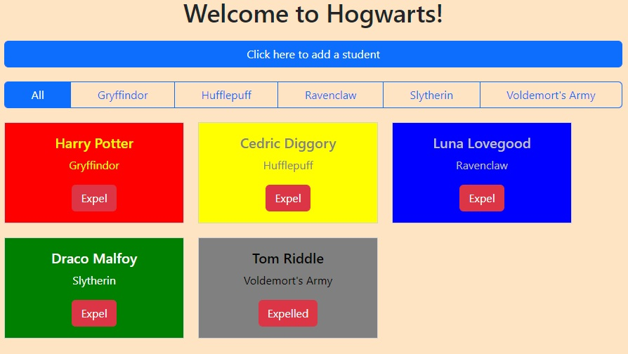

# Sorting Hat  

This app allows users to create and 'expel' student entries that are randomly sorted between four houses.

[View App](https://mcgee-sorting-hat.netlify.app/)

## About the User 
- The ideal user is a teacher or team leader
- They would like to use a randomized sort to assign groups
- The problem this app solves is allowing users to input names and sort randomly into groups without the need for more decision making or perihpherals like dice or cards

## Features 
- Ability to add new students and have them randomly sorted into 4 houses, then each one gets a card output to the DOM.
- Each card is colored based on house for extra readability.
- The user can filter the output so that it only shows cards from specific groups
- Entries that are 'expelled' from the roster show up in a separate category called Voldemort's Army.

## Video Walkthrough of Sorting Hat
https://www.loom.com/share/0a9583b159be4209a37d37267c6f8c85?sid=0c15aad5-a190-4055-bf95-eaabf7f6829e

## Relevant Links 
- [Check out the deployed site](https://mcgee-sorting-hat.netlify.app/)
- [Project Board](https://github.com/users/mikemcgee92/projects/1)

## Project Screenshots 

## Contributors
- [Mike McGee](https://github.com/mikemcgee92)
